# Cartographie du moteur

Comment TechnoHab transforme **cinq réglages** en un **plan d'habitation dessiné,
mesuré et jugé**. Ce document n'ajoute aucune règle : il montre où vivent celles
qui existent, et dans quel ordre elles s'appliquent.

Entrée dans le code par ordre d'utilité : `assets/generator.js` (le chef
d'orchestre), `assets/squelette.js` et `assets/typologie.js` (les deux poseurs),
`assets/construction.js` (les murs), `assets/rules.js` (le juge).

Doctrine : [`DOCTRINE.md`](DOCTRINE.md) — unité de conception et chaîne cible.
Ce document cartographie le **runtime actuel** (room-first) ; il ne remplace
pas la doctrine.

---

## 1. Le trajet complet, en une image

Ce que fait le moteur entre le clic sur « Générer » et le plan à l'écran.

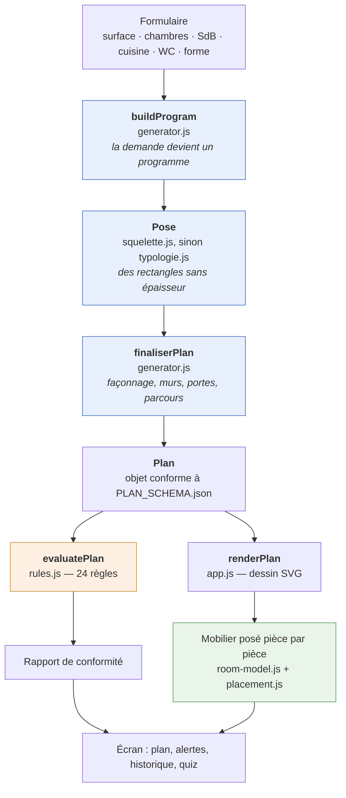

Trois idées à retenir dès maintenant :

1. **Le moteur ne cherche plus sa disposition, il la pose.** Le graphe demandé
   est une étoile dans 840 cas sur 840 : la forme de la réponse est connue
   d'avance, c'est le couloir desservant.
2. **Les cloisons arrivent en dernier.** Toute la pose raisonne sur des
   rectangles sans épaisseur ; `construction.js` les épaissit ensuite, et c'est
   seulement là que la surface *habitable* devient connue — d'où les boucles de
   correction.
3. **Le juge est séparé du producteur.** `rules.js` ne sait pas comment le plan
   a été fait ; il ne lit que sa géométrie finale.

**Depuis M1, l'interface ne demande plus un plan nu.** Elle appelle
`generateResult()` et reçoit successivement les contrats `Intent`, `Program`,
`TopologyCandidate`, `BuiltPlan` et `Verdict`, réunis dans un
`GenerationResult`. `generatePlan()` reste l'adaptateur des scripts historiques.
Les quatre issues ne sont plus confondues : `VALID`, `IMPOSSIBLE`,
`NON_TROUVE`, `INVALIDE_DEBUG`. Voir `CONTRATS_MOTEUR.md`.

Les pilotes `TOILET_SEPARATE` et `BATHROOM_WITH_TOILET` sont C4 : leurs
domaines isolés, variantes et conflits d'ouvrant sont figés avant leur entrée
dans l'orchestration M2. Les autres profils restent C2.

---

## 2. Les modules et leur ordre de chargement

Seize fichiers, aucune dépendance externe, aucun build. Chaque module se déclare
dans `globalThis` sous un nom `TechnoHab*`, et l'ordre des `<script defer>` dans
`index.html` est l'ordre des dépendances.

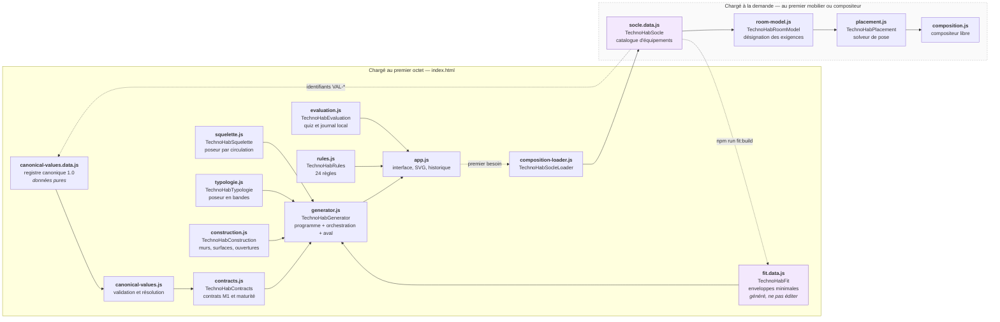

Deux points de vigilance :

- **`fit.data.js` est un produit, pas une source.** Il est compilé depuis
  `socle.data.js` par `npm run fit:build`. Le générateur le lit lui plutôt que le
  socle pour ne pas casser le chargement paresseux : le socle pèse 23 Ko et ne
  sert qu'au mobilier.
- **Le socle ne descend qu'au premier usage.** Ouvrir la page sans afficher le
  mobilier ne le télécharge jamais.
- **Le canon voyage par référence.** Le registre complet porte unité, source,
  statut et portée ; `Program`, `BuiltPlan` et l'export ne dupliquent que
  `{id, version}`. Le consommateur résout ensuite la valeur dans le registre
  validé, sans recopier sa doctrine dans le moteur.

---

## 3. De la demande au programme — `buildProgram()`

Le programme est la liste des pièces à loger, leur surface visée, et le graphe
d'adjacences *souhaité*. Rien de géométrique encore.

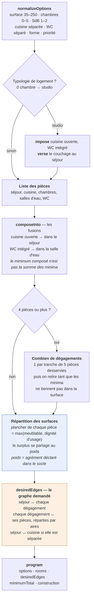

**Le double plancher.** Chaque pièce porte deux minima qu'un seul nombre
confondait autrefois, et le moteur retient le plus exigeant :

| Plancher | D'où il vient | Ce qu'il dit |
|---|---|---|
| `smallest` / `narrowest` | calculé par le solveur de pose, compilé dans `fit.data.js` | « la pièce reçoit son mobilier » |
| `minProgramArea` / `minProgramSide` | convention assumée, déclarée dans `socle.data.js` | « la pièce mérite son nom » |

Un séjour se meuble dès 3,24 m² et reste absurde à cette taille : d'où le
plancher de 20 m².

---

## 4. La pose — deux poseurs, l'un en repli de l'autre

`generatePlan()` essaie le squelette ; s'il refuse, il descend sur la typologie
en bandes, en retirant un dégagement à chaque échec.

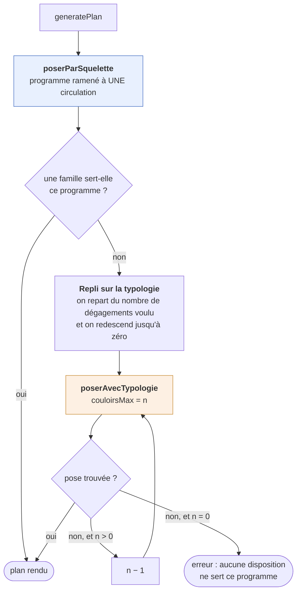

Pourquoi deux poseurs : le squelette produit des organisations que les bandes ne
trouvent pas — 45 signatures distinctes sur un T4 de 100 m² contre 4 — mais il
**refuse plus souvent**. La typologie sert les studios, les programmes saturés et
tout ce que le squelette ne sait pas loger. Aucun des deux n'est « l'ancien » :
ils se complètent.

### 4a. Le squelette — la circulation d'abord, les pièces ensuite

Renversement de méthode du 25 août 2026. On pose d'abord le réseau de
circulation ; les pièces remplissent les **poches** qu'il laisse. L'adjacence
n'est jamais cherchée : elle est une propriété de la disposition.

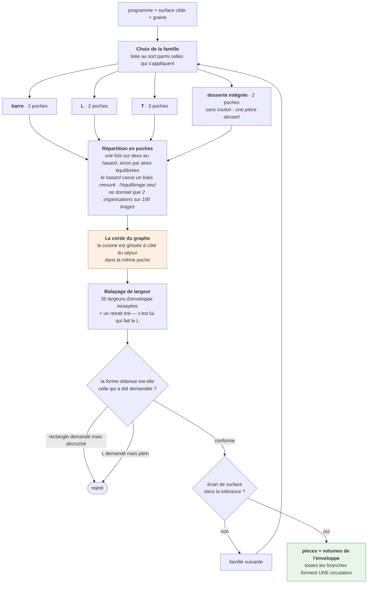

Une **poche** est une bande de pièces bordant une branche sur toute sa longueur ;
sa largeur et sa profondeur lui sont propres. Deux poches de longueurs
différentes laissent un retrait — et ce retrait **est** la forme en L.

### 4b. La typologie — le couloir desservant, en bandes

Trois poseurs de sévérité décroissante, essayés sous quatre paliers de tolérance.
Le moteur ne doit jamais rester muet sur un programme que l'interface accepte.

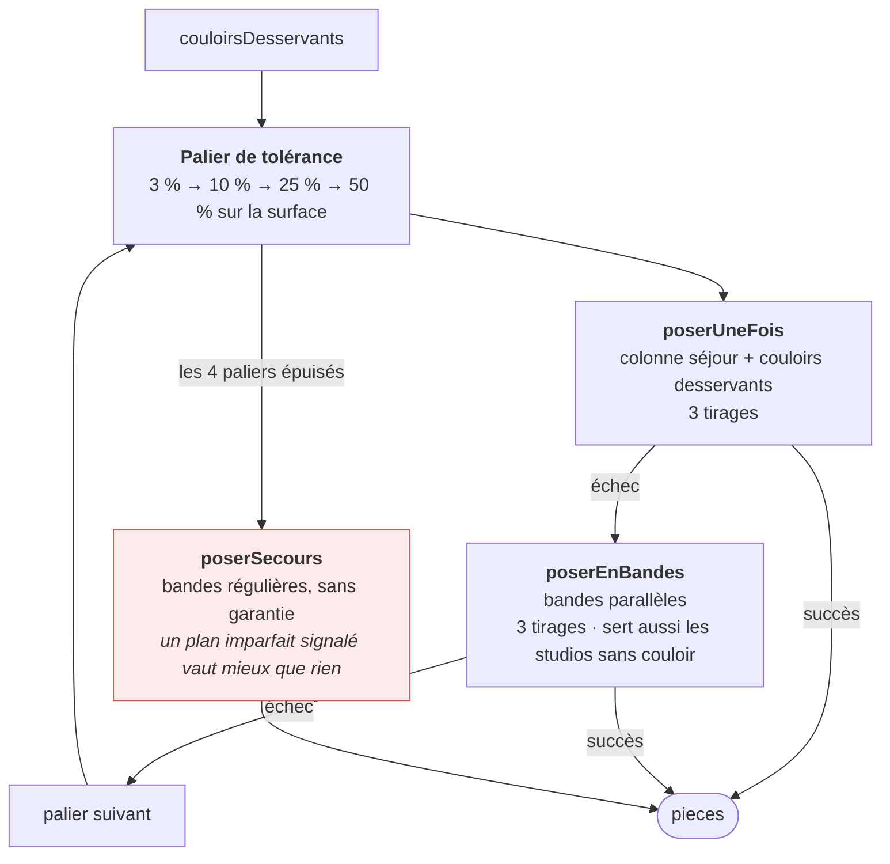

Les paliers relâchent d'abord la **surface**, puis la **largeur de desserte** ;
les cotes de meublabilité, elles, ne bougent jamais. Un plan servi sans garantie
de desserte n'est pas caché : `TH2D-GRAPH-001` le signalera au rapport.

---

## 5. L'aval commun — `finaliserPlan()`

Tout ce qui suit la pose est identique pour les deux poseurs, et identique aussi
pour un plan dessiné à la main via `assemblerPlan()` — sans quoi l'instrument de
mesure ne mesurerait pas le moteur.

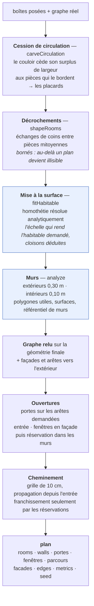

### La boucle de surface, et pourquoi elle existe

La demande porte sur la surface **habitable**. Les poseurs raisonnent en surface
de **partition** — cloisons comprises. L'écart n'est connu qu'après
`finaliserPlan()`, donc on corrige la cible et on repose.

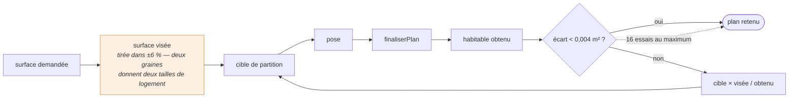

On repose plutôt que de mettre le plan à l'échelle : **une largeur réglementaire
ne s'homothétie pas.** Un couloir de 1,20 m réduit de 10 % tombe sous le seuil.

---

## 6. Le contrôle — `rules.js`

24 règles évaluées sur la géométrie finale, sans rien savoir de sa fabrication.

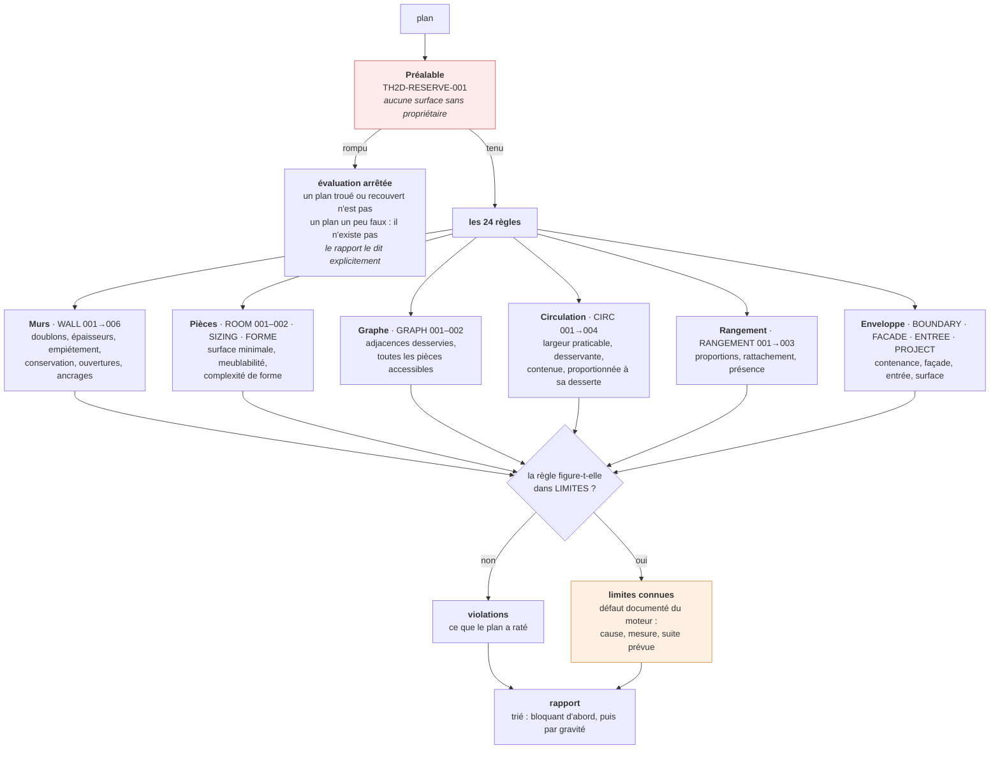

**Deux niveaux, et un troisième statut.** `HARD` bloque, `GUIDELINE` conseille.
La table `LIMITES` est le troisième : elle déclasse trois règles dont on *sait*
qu'elles échouent, avec la cause, la mesure datée et la suite envisagée. Un
manquement connu et chiffré n'est pas la même chose qu'une surprise.

---

## 7. Le mobilier — au rendu, pas à la génération

Le générateur ignore le mobilier. Il ne connaît que des surfaces, et se contente
de garantir qu'elles sont *meublables* via les enveloppes de `fit.data.js`. La
pose réelle des meubles se calcule à l'affichage.

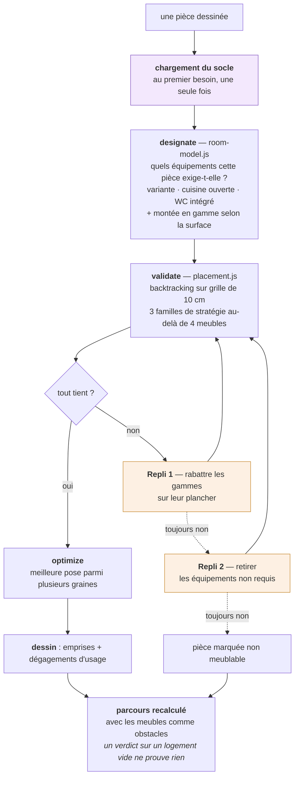

L'ordre des replis n'est pas arbitraire : rabattre une gamme rend à la pièce le
meuble qu'elle avait avant les gammes ; retirer un optionnel lui **ôte** du
mobilier. Dans cet ordre, une montée en gamme ne peut jamais rendre non meublable
une pièce qui l'était.

---

## 8. La chaîne des données

Une seule source décrit une pièce. Tout le reste en descend.

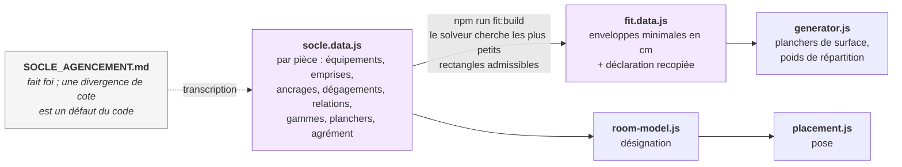

Motif : le moteur portait autrefois `minArea`, `minSide` et `weight` en dur, le
socle portait les équipements, et rien ne garantissait que les deux parlent de la
même pièce. Ajouter une pièce se fait aujourd'hui **dans le socle seul**, suivi
d'un `npm run fit:build`.

---

## 9. Le déterminisme et la graine

Tout ce qui varie passe par une seule graine, et chaque plan la porte.

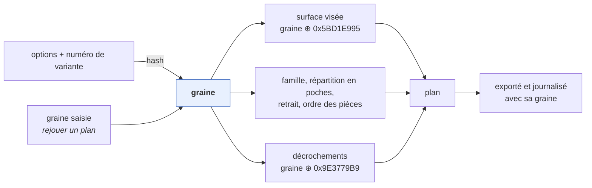

Conséquence pratique : **un échec est rejouable**. L'historique de l'interface
conserve pour chaque génération sa graine, ses règles enfreintes, l'écart mesuré
et le seuil — on n'a pas à noter à la main ce qui s'est produit.

---

## 10. Où est quoi

| Fichier | Responsabilité | Documentation de référence |
|---|---|---|
| `assets/generator.js` | programme, orchestration, aval commun, portes, cheminement | `MODELE_DE_CALCUL.md` |
| `assets/squelette.js` | pose par squelette de circulation | `DOCTRINE_CIRCULATION.md` |
| `assets/typologie.js` | pose en bandes, couloir desservant | `DECOUPE_ET_GRAPHE.md` |
| `assets/construction.js` | murs, surfaces, ouvertures, réservations | `MURS_EPAIS.md` |
| `assets/rules.js` | les 24 règles et leurs limites connues | `SUIVI_REGLES_PIECES.md`, `MODELE_EXIGENCES.md` |
| `assets/socle.data.js` | catalogue d'équipements et de relations | `SOCLE_AGENCEMENT.md`, `GAMMES_EQUIPEMENTS.md` |
| `assets/fit.data.js` | enveloppes minimales — **généré** | `PROTOCOLE_MESURES.md` |
| `assets/room-model.js` | désignation des exigences d'une pièce | `DOCTRINE_AGENCEMENT.md` |
| `assets/placement.js` | solveur de pose du mobilier | `PLACEMENT_ET_ADJACENCES.md` |
| `assets/app.js` | interface, rendu SVG, historique, export | `DA_CHEMINEMENT_PLAN.md`, `DA_ICONES_PLAN.md` |
| `assets/evaluation.js` | quiz de qualité perçue, journal local | — |
| `PLAN_SCHEMA.json` | contrat de sortie du moteur | — |

### Les bancs de mesure

Aucun n'est un test unitaire : ce sont des instruments qui produisent des
chiffres, et les chiffres cités dans les commentaires du code viennent de là.

| Script | Ce qu'il mesure |
|---|---|
| `scripts/scan-seeds.mjs` | conformité sur un balayage de graines et de configurations |
| `scripts/scan-capacites.mjs` | quels programmes le moteur sait servir |
| `scripts/diagnostic-desserte.mjs`, `diagnostic-circulation.mjs` | qualité de la distribution |
| `scripts/test-*.mjs` | invariants ciblés — murs, formes, fusion, contour, entrée… |
| `scripts/test-instrument.mjs` | le plan de référence dessiné à la main, passé dans le même aval |
